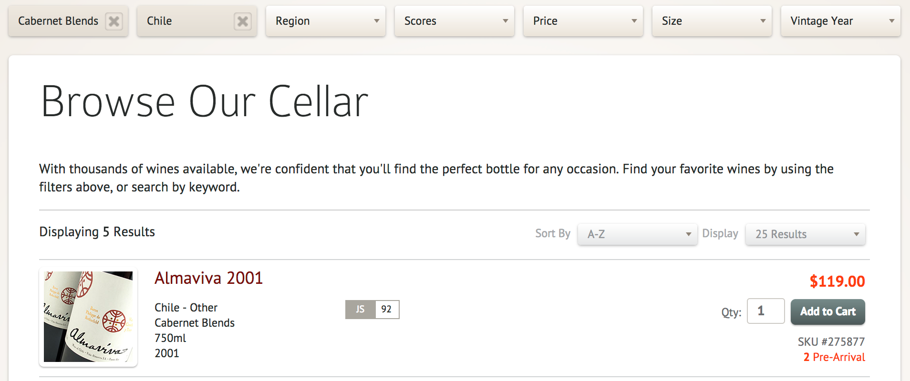

# Code Sample

Hey Jason and Mike! I wanted to give you some context around this code sample so you would have a better idea of what you're looking at. This code is extracted from recent work with a current client of mine that is in the wine selling business. In this latest set of work I'm doing for them, we've been pulling out their previous search engine (Solr) and replacing it with Elasticsearch (using the [`searchkick`](https://github.com/ankane/searchkick) gem).

Their wine search is fairly involved, and the code to handle various aspects of it was spread around the controller, the model, the views, and in a few service objects. I was seeking to consolidate all of that logic into a service object that could be called in the controller and views as necessary. In addition to the final version of the service classes I ended up with, I've also included the controller (and corresponding concern, because the Wine search is used in another controller) and the view partial that renders the search filters. The view is not the prettiest code. I decided against heavily refactoring it, because the next step after changing out the search engine will be to implement a new front end design for the wine searching. So all of the view code is going to be ripped out soon.

## Feature Overview

The wine search has multiple fields (sometimes called facets, or aggregations in Elasticsearch's case) that can be filtered on. The list of fields are

* Bottle Size (750ml, 1.5L, etc.)
* Country
* Price (ranges)
* Region
* Score (ranges)
* Varietal
* Vintage (some ranges, some specific vintages)

Some of these filters have predetermined set values that you can select. For instance, the list of bottle sizes, the price ranges, the score ranges, and the vintage ranges. The rest of the filters have values which are determined by the data set of currently available wines.

We need to be able to filter the set of wines by the values for these filters. Some of the values are scalar values (Ex: Filter by Country where `country` is `United States`), and some of the values are ranges (Ex: Filter by Vintage where `vintage` is between `1980` and `1990`).

In addition to being able to filter results properly by the selected filter value, we need to be able to generate a list of options for a select menu for each of these filters. We also need to know how many results there are for each filter value (we use this to hide filters that would result in zero matches).

There is also some sorting and pagination options, but those are much simpler and less interesting, so I won't cover them here.

## Code Walkthrough

I start with a service object, a `WineSearcher` module. If we ever needed to do this kind of complex searching with another type of model, this module could easily be refactored and the core searching logic extracted into some kind of Searcher module and the WineSearcher could just include the things specific to that model. But that was not necessary here, so I left it coupled for now.

The `WineSearcher` defines a list of filters. Filters all extend the `WineSearcher::Filter` module. Each filter is a module that defines a list of values and defines how to pass itself to Elasticsearch as an aggregation definition.

If we step into the `WineSearcher::Filters::BottleSize` definition, we can see that it just defines a fixed list of values, in a constant. The values are actually `WineSearcher::FilterValue` objects. The `FilterValue` object lets us define a couple of things that all go with this filter value. We define the human name, the parameter value that gets used in the forms, the bucket key (which is what we use to grab the record count info out of the aggregation data), the bucket value (which is what we use to define the bucket for the aggregation), and the searchkick filter (which is what we use to pass to searchkick to perform the filtering).

That was an example of a static list of values, if we look at the `WineSearcher::Filters::Country` definition we'll see a dynamic one. It defines the `values` method by plucking all the unique values for `country`, tossing out any nil value, sorting it, and mapping the list to the corresponding contry filter value. `COUNTRY_FILTER_VALUES` acts as a cache so that we don't continually instantiate the same filter values on every request. It is defined as a hash that has a default block defined that, upon key miss, will construct the proper `FilterValue` and save it back into itself.

There is a potential for the `Wine.uniq.pluck(:country)` to cause us some issues, since it will always run a query. It makes it so that any time we ask for values of this Country filter, we must run a query to respond. In practice, this will be less bad, due to the `ActiveRecord::QueryCache` middleware which will cache all requests and return immediately without hitting the database for duplicate queries. But it still means that the query will happen once on each load of the page. It insures that the data is as fresh as possible. If a new wine is added from a new country, it will immediately show up in the list. This is likely not going to be a common occurrence, so this value will likely end up being cached on app boot, after we do some profiling on our staging environment.

Let's look through one other filter. The `WineSearcher::Filters::Vintage` filter has a list of values that is partially static, and partially dynamic. There is a static list of vintage ranges (80's, 70's, etc.) and a dynamic list of single years spanning from 1990 to the present year. The static values are stored in a constant, and the dynamic values get mapped from a caching hash like in the Country filter.

Let's take a step back to the `WineSearcher` module now, and look at it's public API. It defines a `run` method which performs the search, a `param_to_human` for looking up the human name for a given filter's param value. It also has a `filter_options` method which returns an array of options for a given filter, ready to be passed into the `options_for_select` ActionView helper. Both `param_to_human` and `filter_options` take a filter name as the first argument, and delegate the method call to that filter.

Finally we can take a look at the controller and view files to see how the `WineSearcher` module is used. The controller (with the help of some abstracted filter formatting from the `WineSearching` concern) calls `WineSearcher.run` giving it a few pagination and sorting options, and then passing in the filters.

The view partial for the search filters constructs the select boxes with the proper options. Because the `@search` object is passed in to the `filter_options` method, we also get a `data-result-count` attribute added to each option element. Some javascript will then hide those options from the user. If a value for any given filter has already been selected, there will be a box containing the filter value (which is mapped to a human friendly string with the `param_to_human` method), and an "X" to clear the filter.

There is more here than what I've covered. I've only gone over the service object structure, and the public APIs. The majority of the work happens in private methods. Please let me know if you have any questions about why something is the way that it is, or if something is confusing.

Thanks for your consideration!
